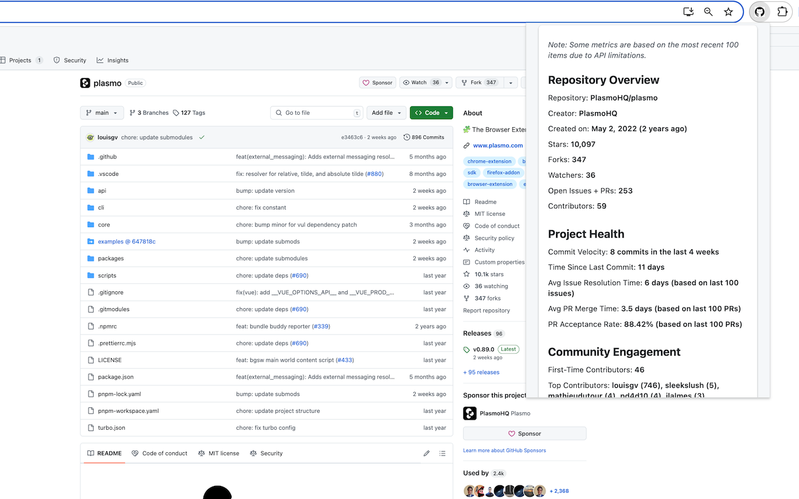
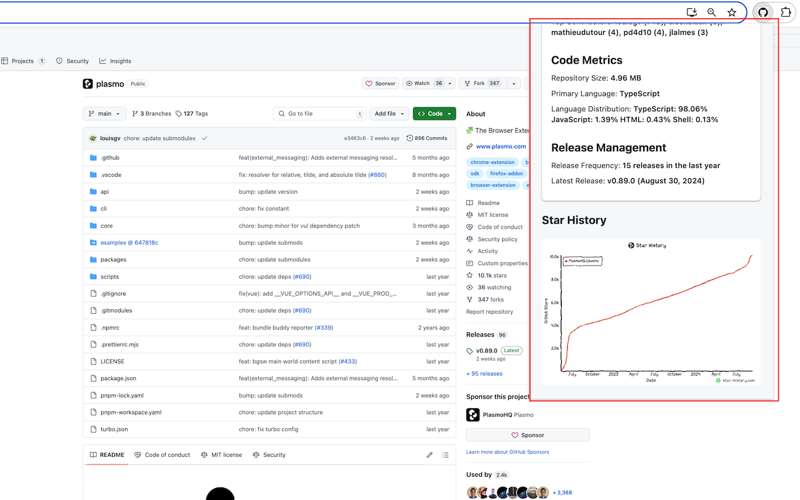

# GitInsight

A Chrome extension that provides instant GitHub repository analytics. Get key metrics on project health, community engagement, code stats, and release management right in your browser.

## Features

- **Repository Overview**: Quick access to stars, forks, watchers, and other basic stats
- **Code Activity**: Track commit frequency, code additions/deletions, and contributor metrics
- **Community Engagement**: Monitor issues, pull requests, and discussion activity
- **Release Management**: View release history and version data

  
  

## Installation

### From Chrome Web Store

1. Visit the [GitInsight extension page](https://chrome.google.com/webstore/detail/gitinsight/chbngnmfhekcdmidbhelkiggbnboedob) in the Chrome Web Store
2. Click "Add to Chrome"
3. Confirm the installation when prompted

### Manual Installation (Developer Mode)

1. Download or clone this repository
2. Open Chrome and go to `chrome://extensions/`
3. Enable "Developer mode" in the top-right corner
4. Click "Load unpacked" and select the extension directory
5. The GitInsight extension should now be installed and visible in your toolbar

## Usage

1. Navigate to any GitHub repository page
2. Click on the GitInsight extension icon in your browser toolbar
3. For the first use, you'll need to provide a GitHub personal access token:
   - Go to [GitHub Personal Access Tokens](https://github.com/settings/tokens)
   - Generate a new token with the `repo` scope
   - Copy and paste the token into the extension
   - Click "Save Token"
4. View the analytics for the current repository
5. Click "Refresh" to update the data

## GitHub Token

GitInsight requires a GitHub personal access token to fetch repository data. The token is stored locally in your browser and is never sent to our servers. To create a token:

1. Visit [GitHub Personal Access Tokens](https://github.com/settings/tokens)
2. Click "Generate new token"
3. Give it a descriptive name (e.g., "GitInsight Extension")
4. Select the `repo` scope (only read access is needed)
5. Click "Generate token"
6. Copy the token and paste it into the extension

## Privacy

- All data is processed locally in your browser
- Your GitHub token is stored securely in Chrome's extension storage
- No data is collected or transmitted to third-party servers

## Contributing

Contributions are welcome! Please feel free to submit a Pull Request.

1. Fork the repository
2. Create your feature branch (`git checkout -b feature/amazing-feature`)
3. Commit your changes (`git commit -m 'Add some amazing feature'`)
4. Push to the branch (`git push origin feature/amazing-feature`)
5. Open a Pull Request

## License

This project is licensed under the MIT License - see the LICENSE file for details.

## Support

If you encounter any issues or have questions, please [open an issue](https://github.com/keith666666/git-insight/issues) on the GitHub repository.
